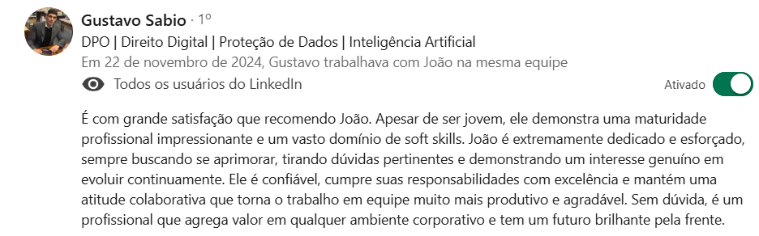
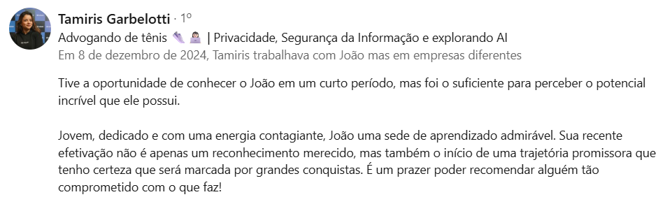

# Portfólio – João Paiva

💼 Este repositório contém o meu portfólio pessoal, publicado com **GitHub Pages**, onde reúno os principais projetos que desenvolvi em Inteligência Artificial, automação e soluções orientadas a dados.  
Meu foco é construir soluções para problemas reais, gerando produtos, serviços e protótipos que criem valor.

🔗 Acesse o portfólio em: https://joaomdpaiva.github.io

---

## Sobre o portfólio

No site você encontrará:

- **RemoteSense AI** – Assistente com IA para apoiar quem trabalha remoto ou em home office, ajudando a organizar rotina, foco e bem‑estar.  
- **FlexIA** – Totem interativo com IA para espaços educativos e culturais, com experiência multimodal e recursos inclusivos.  
- **Smart Irrigation** – Sistema experimental de automação de irrigação, integrando IoT, coleta de dados e análises para ensino e pesquisa.  

Todos os projetos incluem descrição do problema, tecnologias usadas e links diretos para os repositórios e/ou demos.

🗣️ Recomendações

Tive a oportunidade de trabalhar com profissionais que confiaram no meu trabalho e registraram recomendações no LinkedIn. Segue alguns exemplos:

---

## 🗣️ Recomendações

Tive a oportunidade de trabalhar com profissionais que confiaram no meu trabalho e registraram recomendações no LinkedIn. Alguns exemplos:

**Everton Marcelino Jr. – CTO, Stift**  

**Davi Rost – CEO, Stift**  

**Gustavo Sabio – DPO / Colega na QI Tech**  

**Tamiris Garbelotti – Colega na QI Tech**  

---

## 📬 Contato

- LinkedIn: https://www.linkedin.com/in/joaovmpaiva  
- E-mail: jvmp.2005@gmail.com  

Sinta‑se à vontade para enviar feedbacks, sugestões ou oportunidades de colaboração.

---

  

